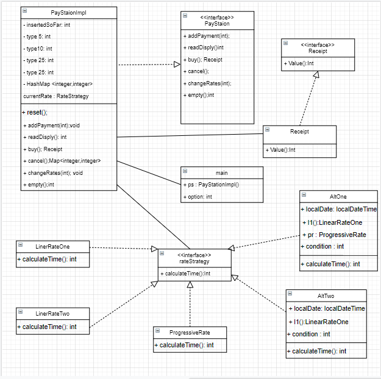

# paystationmain-01-akeem-brandon
paystationmain-01-akeem-brandon created by GitHub Classroom

Brandon Satz

Akeem Yusef Powar

## Requirements:

(Practicing pull requests)

(Designing a Main for the Paystation program)

(Interface with 6 options, 2 exclusive to Admins)

(Options include depositing 5/10/25 cents, showing bought time on display, buying ticket, canceling orders)

(Admin options include emptying Paystation & changing rate strategies from 5 different "towns")

### Akeem

For this lab, were required to build a main function that could run a pay station UI and was capable of being implemented in different locations on the pay station network. We were required to implement this is in teams, utilizing github. 
The pay Station offers users the options of inserting coins, check the display to see how much time they currently can purchase, buy a ticket, or cancel the current transaction. The pay station must also have admin features that enable staff to empty the machine or change the station rate. 

For the rate strategies, were chose a compositional model for 2 reasons. 

1. Initially trying a build a parameterized strategy was confusing as neither my partner nor I really understood how this was meant to be done and our original UI was also driven by if statements. 

2. After discussing the project in lab with Paul and with Dominic’s last moment addition, compositional seemed the best and intended approach as well as presenting a chance to further my understanding of java. 

Extra credit: My partner did implement a parametrized approach to the rateStrategy but the program at the time was designed wrong. This version will need to be updated to work with the current model but it was done. 

## UML of current system

## Teamwork:

### Brandon: 
We were able to work together pretty well. Akeem worked on setting up the interface, the rate strategies, and the cancel & empty functions. I worked on the deposit, change rate, display, and buy functions, and later implemented each rate strategy into each function on the program. Akeem was very quick and skilled with his coding, other than what I mentioned above I was mostly going over revisions of the code. Working together with someone at a much higher skill level than mine can be tough for me, but I was able to manage and contribute quite a lot to this lab project.

### Akeem: -

## Testing:

### Akeem
When the whole project was built in main, I tested everything I implemented as a unit but with print statements. e.g. to test cancel, I would fill the map and see what cancel returns. Here is where I discovered most of my fundamental errors that compromised usability. These included but are not limited to:

-	The initial loop would cancel after a single option and it did not account for non-numerical input.
-	The conditions that govern behaviour were not correct
-	 progressive rate uses 3/10 in its calculation, I was always getting 0 returned.
-	Making sure the machine was aware of days of the week.

Once I had fully implemented the rate change functionality, I did create a unit test and hard wired a way to change the rate so that I could test all the rates by changing one int. 

Upon completion, I ran main under various conditions trying to find any bugs or user experience improvements that could be made. Here I found issues with addPayament only taking one coin before going back to the menu and what I suspected were null pointer issues error in readDisply.
All tests I wrote or carried out were conducted after writing code and were used to decide if a function was working correctly or needed additional work before moving on. 

After further testing, a null pointer error was traced to AltOne and AltTwo. I had not initialized the instance variables correct.
"linerRateOne l1;" VS "linerRateOne l1 = new linerRateOne();" 

